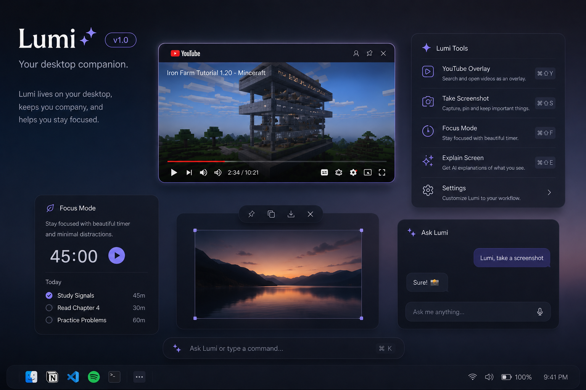

# Lumi

<p align="center">
  
</p>

<h1 align="center">Lumi</h1>

<p align="center">
  Calm floating workspace panels for YouTube, screenshots, images, and PDFs on macOS.
</p>

<p align="center">
  <a href="https://github.com/siarozgur-netizen/LUMI-/releases">Download beta</a>
  ·
  <a href="#what-lumi-does">What Lumi does</a>
  ·
  <a href="#keyboard-shortcuts">Keyboard shortcuts</a>
  ·
  <a href="#local-development">Local development</a>
</p>

<p align="center">
  
</p>

## What Lumi does

Lumi is a native macOS workspace layer for keeping lightweight reference surfaces around your desktop without turning your screen into a full window manager.

Current panel types:
- WebPanel for YouTube and lightweight web viewing
- ImagePanel for screenshots and images
- PDFPanel for quick document reference
- Guide Panel for keyboard shortcut discovery
- Command Bar as the launcher-style home surface

The product direction is intentionally simple:
- launch into a branded command surface
- open only the panels you want
- keep the desktop calm, spatial, and lightweight

## Why Lumi feels different

Lumi is not trying to be:
- a browser replacement
- a tiling system
- a heavy productivity dashboard

It is trying to be:
- a calm ambient workspace layer
- a premium native macOS utility
- a fast way to keep media and reference material nearby

## Beta download

Download the latest macOS beta from the [Releases](https://github.com/siarozgur-netizen/LUMI-/releases) page.

Current public beta target:
- `v0.1.0-beta.1`

If Gatekeeper warns on first open:
1. unzip `Lumi.app.zip`
2. right click `Lumi.app`
3. choose `Open`
4. confirm once, then launch normally after that

Notes:
- current beta builds may be unsigned or not notarized yet
- Apple Silicon is the primary target
- macOS 13+ is the intended platform baseline

## Keyboard shortcuts

Global shortcuts currently shipped in the app:

| Shortcut | Action |
| --- | --- |
| `Ctrl + Option + L` or `Ctrl + Option + Space` | Open Lumi command bar |
| `Ctrl + Option + O` | Toggle workspace panels |
| `Ctrl + Option + T` | Toggle theater mode |
| `Ctrl + Option + H` | Return web panel to home |
| `Ctrl + Option + C` | Show keyboard shortcuts guide panel |
| `Ctrl + Option + P` | Play / pause |
| `Ctrl + Option + ←` | Seek backward 10s |
| `Ctrl + Option + →` | Seek forward 10s |
| `Ctrl + Option + 2` | Capture area to panel |
| `Ctrl + Option + S` | Open sample image panel |

## Current status

Lumi is currently in active beta iteration.

That means:
- the product direction is real
- the app is usable today
- the repo and release surface are being cleaned up in parallel with product polish

Some internal names still use `PlayLayerMac` while the public-facing identity is now `Lumi`. That is intentional for stability during the transition.

## Local development

Requirements:
- macOS 13+
- Xcode / Swift toolchain with SwiftPM support

Build:

```bash
swift build
```

Run:

```bash
swift run Lumi
```

Open in Xcode:
- open `Package.swift`

## Repo structure

```text
Sources/PlayLayerMac/
  App/
  Config/
  Panels/
    CommandBar/
    Image/
    PDF/
    Shared/
    Web/
  Services/
```

## Contributing

Contributions are welcome, especially around:
- native macOS polish
- panel ergonomics
- rendering stability
- shortcut-driven workflows
- release quality

Before opening a PR, please read [CONTRIBUTING.md](CONTRIBUTING.md).

## Security

If you believe you found a security or privacy-sensitive issue, please read [SECURITY.md](SECURITY.md) before opening a public report.

## License

MIT. See [LICENSE](LICENSE).
